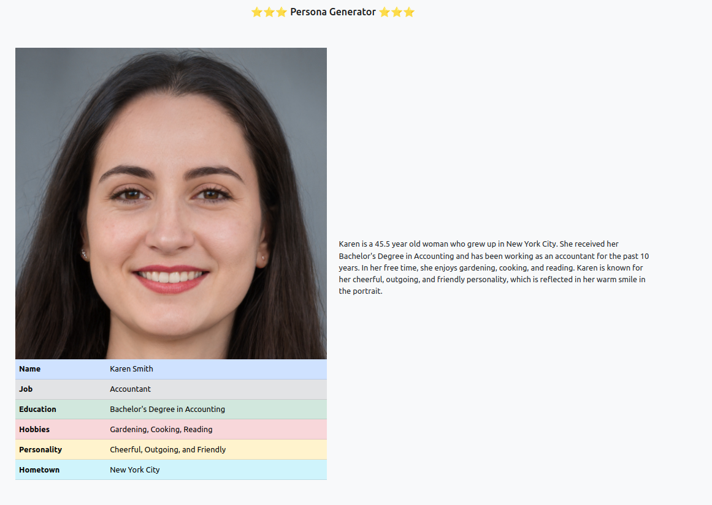
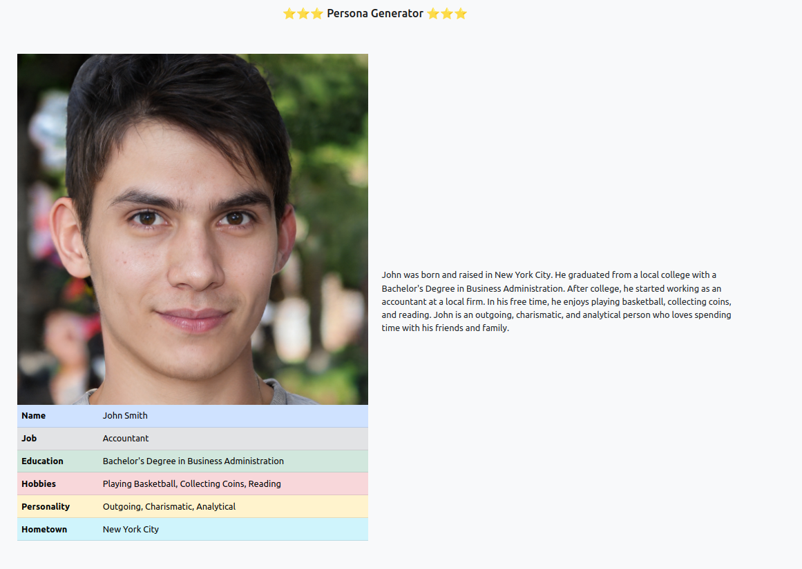
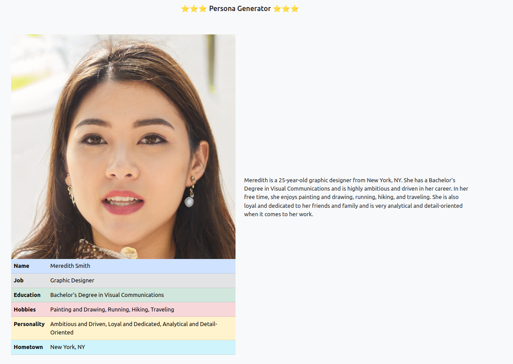
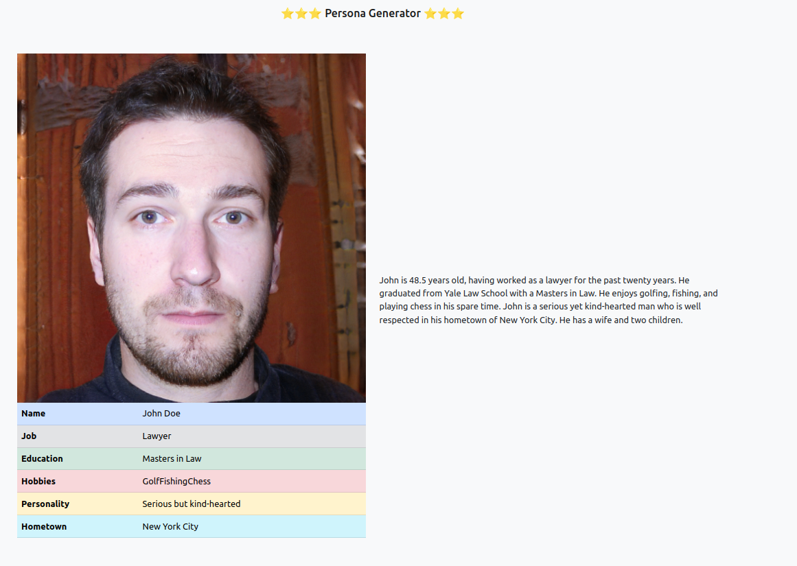

# PersoneGenerator

#### PersonGenerator is a web application built with Flask that presents random person picture with random background stories

## Features

- Generate person information: Users can generate random person information by clicking the "Generate" button on the application.
- View generated information: The generated person information is displayed on the application for the user to view.

# examples 
 
 
 
 
 

# credits
PersonGenerator was created by [Dvir Pashut] and [Elior Estring] (who did most of the job).

# recources

[openai]  
[this-person-does-not-exist]  
[aws rekognition]  

**Free Software, Hell Yeah!**

[//]: # 

[Dvir Pashut]: <https://github.com/dvir-pashut>
[Elior Estring]:<https://github.com/elior7557>
[openai]:<https://openai.com/>
[this-person-does-not-exist]:<https://this-person-does-not-exist.com/en>
[aws rekognition]:<https://docs.aws.amazon.com/rekognition/latest/dg/what-is.html>
